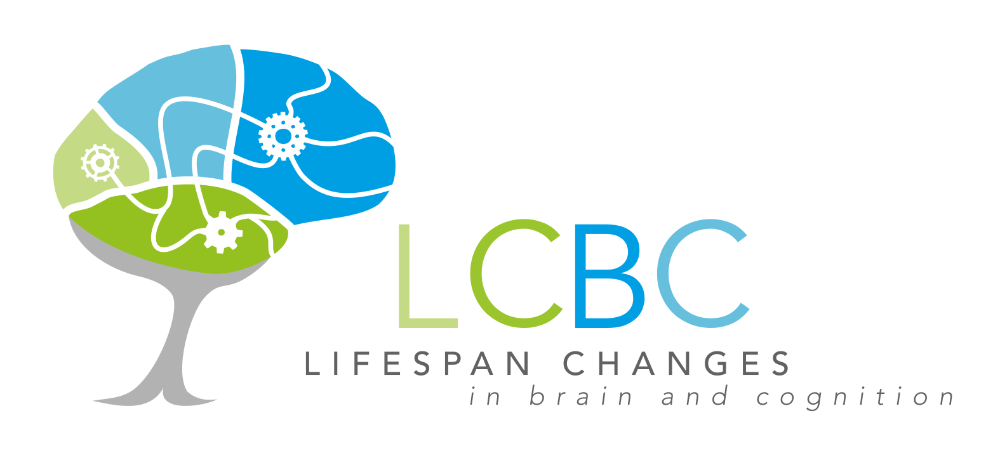

  

## Data explorer and extractor for centre data  

 

This is the Shiny app custom made for The Center for [*Lifespan Changes in Brain and Cognition*](https://www.oslobrains.no/) at the [*University of Oslo*](https://www.uio.no), Norway.   

This Shiny app enables researcher at LCBC to explore and extract data from the combined dataset of the entire center. The App is specifically created to work with data from LCBC, and is not easily changed to work with other data sources.   

### Using the app

Whatever is running the application, must have access to the *MOAS.RData* file. Either by using it on TSD (*link being added*), having the application run on your own computer via R, or on the [hosted online server](https://athanasiamo.shinyapps.io/ShinyLCBC/). Using the last two options, the application wil prompt you do upload the *MOAS.RData* file manually, on TSD it is loaded for you by default.

### On TSD

*instructions to be added*

### Online hosted server

*instructions to be added*

### Local computer

*instructions to be added*

