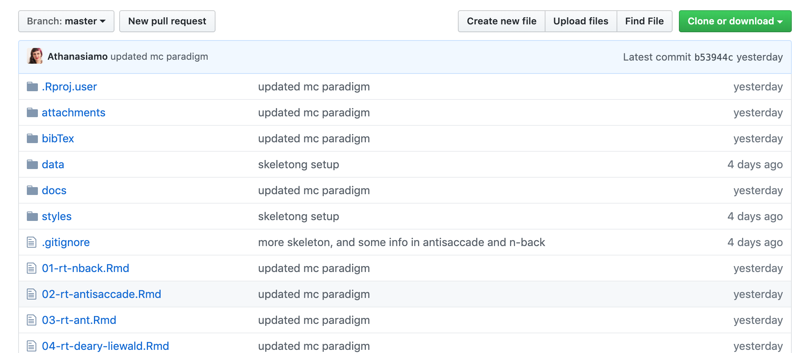
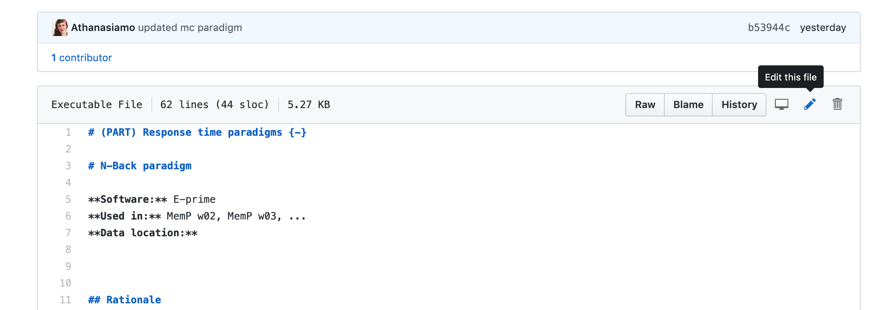
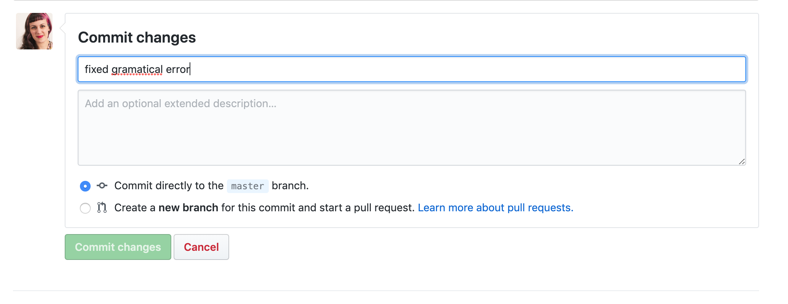
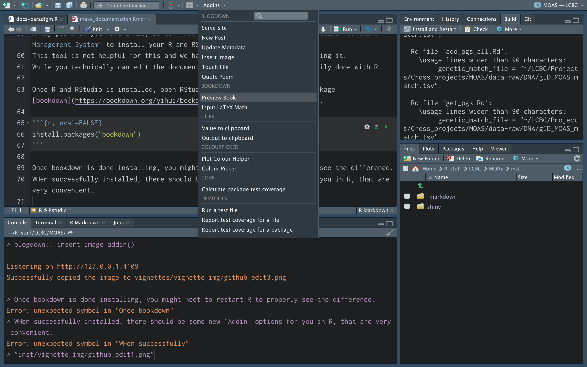

```{r, include = FALSE}
knitr::opts_chunk$set(
  collapse = TRUE,
  comment = "#>"
)
```

```{r setup}
library(MOAS)
```

In LCBC we have several documentation books that are made in R, and rendered into html and pdf for reading, and hosted online on github. 
Using the package [bookdown](https://bookdown.org/yihui/bookdown/), these books are based on R Markdown files, and renderes into the necessary other file types based on that through R. 
While setting up R Markdown to work with pdf for the first time is a bit of a hassle, it is worth the effort, as the resulting documentation is in a nicely readable and ordered format. 
I highly recommend using the [bookdown site](https://bookdown.org/yihui/bookdown/) as a reference manual on how to add things to the documentation, and the Rmarkdown [cheatsheet](https://github.com/rstudio/cheatsheets/raw/master/rmarkdown-2.0.pdf) is also very handy!

In order to aid users set up new pages to the different documentation, re-ordering pages, setting-up support files etc., I have made some R functions to help you get started. 
Since we have several different types of documentation, the functions depend on which documentation you wish toset up a new page (chapter) for.

## Editing documentation online (on github)
You may alter the documentation directly online. 
Doing this is the simplest for those who only need to make minor changes to already existing chapters. 
It is not recommended to attempt more complex alterations on github than that.

To edit a chapter .Rmd on github, go to the documentation you want to edit (links for each documentation comes below), and click on the .Rmd.


In the next window, click on the pencil icon to start editing in the browser. 


Once the changes you wanted to make are done, scroll to the bottom of the page, type in a message to be added with you changes, and then click "Commit". 


Once this is done, you changes are saved in the _source files_ for the documentation. 
This will **not** alter the rendered version yet, someone needs to go over it and render it again.
It will be done when someone has the time.

The alternative, to get it rendered immediately, means following the steps to get the documentation edited locally to work. 

## Set up for editing the documentations locally

### git
git is a system for version control. 
It is an important aspect of working with the documentation, as we can track the different versions over time and the changes that have been made.
We have a small wiki with information on `git` and links to how to install `git` on your system [here](https://github.com/LCBC-UiO/Mini-Workshops/wiki/General%3A-git).

### R & Rstudio
We also need to make sure you have R and RStudio installed on your system. 
We have a minimal set of instructions to help you get started with that [here](https://github.com/LCBC-UiO/Mini-Workshops/wiki/Analysis%3A-R).
A key point if you have a Mac, is to **not** use the pre-installed UiO software `Software Management System` to install your R and RStudio.
This tool is not helpful for this and we have experienced a lot of bugs using it. 
While you technically can edit the documentation without R, it is most easily done with R.

Once R and RStudio is installed, open RStudio and install the required package [bookdown](https://bookdown.org/yihui/bookdown/), so you can edit the book.

```{r, eval=FALSE}
install.packages("bookdown")
```

Once bookdown is done installing, you might neet to restart R to properly see the difference.
WHen successfully installed, there should be some new `Addin` options for you in R, that are very convenient. 

The most convenient it the shortcut `Preview book` which will attempt to render to book for you and display it in the RStudio Viewer in the bottom right.
Once this had been activated once, it will continue to render the book for each change you save to any document affiliated to the book.



### LaTex for pdf outputs
For the pdf output to be generated you also need a LaTeX version. 
You will not need to know or touch LaTeX it self, but the program must exist on your computer for pdf's to be generated.

You will need to get [mactex](http://tug.org/mactex/mactex-download.html) for mac, or [MikTex](http://miktex.org/download) for windows.


## Manual
The manual contains vital information about data gathering procedures and handling at LCBC. 
This handbook is read by all new staff, and should provide a general guide to how things are done at LCBC. 
The book does not contain the same type of structure as other documentation, and as such there are no templates etc for setting up new chapters, you can just start adding them, and placing them where you believe they make most sense. 

Large changes to the manual **should not** be made without consulting key personell at LCBC.


```
git clone https://github.com/LCBC-UiO/Manual
```

This will clone (copy) all of the files necessary to build on the documentation to into a folder called `Manual` in the folder your terminal is standing in. 
If you **already have cloned the repository before*  there is no point in cloing it again. 
However, you should make sure you are working on the most recent version.
For this you need to navigate into the `Manual` folder and get the newest version from github.
You can do this in the terminal:

```
cd path/to/Manual
git pull
```

Once it is downloaded, enter the folder and open the `Manual.Rproj`.

Once opened, RStudio will have placed your R in the correct working directory and you can start editing files. 
You can edit already existing file by clicking its name in the `Files` pane in RStudio(bottom right). 

Once all your edits are done, it is important to save the changes to `git` and send them to github. 
To do this, click on the `Terminal` tab in the Console area of RStudio.
Here you can work just like in the standard terminal.
You will need to `add` your changes to git, and provide a message when `committing` the change.
Make sure your commit message is meaningful for what you have done, so it is easy to follow the history of changes to the book. 

```
git add .
git commit -m "add your message here, eg added documentation for XX paradigm"
```

Once you have done so, you may in the terminal, run the `_deploy.sh` script.

```
sh _deploy.sh
```

This will re-render the book in all formats requested, and, commit and push the entire log and changes to github.
If you are having troubles rendering the book, let Mo know, she will help you debug.

You will now have sucessfully contributed and re-created the entire book for others to benefit from.
Thank you!
You can have a look at final pushed book 


## Project documentation
Project documentation is vitally important.
We have all experienced forgetting key aspects of data collections and project decisions just within months.
This lack of stable memory for project details is especially difficult when academia is also known for its high personell turn-over.
In order to keep track of projects, data collection etc. we already have the folder system set-up on the lagringshotell that helps somewhat.
However, this system quickly becomes cluttered with many files, and is overwhelming to navigate for new staff.

This is why there is a specific Project documentation book, that should summarise key-aspects of each LCBC project briefly, so people can better understand what these projects are and what to expect from their data. 
By using the same template for all projects, we can ensure that there is easily accessible and understandable information regarding the projects available. 

The older projects have poorer documentation that wanted, so newer projects should aspire to include more information than we currently have available for the older projects. 
As the style of data collection we have, each chapter is organized by its parent Project, with sub-headings for the different waves of data collection within that project.
If not editing information to an already documentet project, by adding a new wave or information to a wave, it is most likely that we will want to add another project (i.e. chapter) to the book. 

To work locally with the documentation, clone the source files [from github](https://github.com/LCBC-UiO/Project-documentation) in the terminal by:

```
git clone https://github.com/LCBC-UiO/Project-documentation
```

This will create a folder called `Project-documentation` with everything you need.
If you **already have cloned the repository before*  there is no point in cloing it again. 
However, you should make sure you are working on the most recent version.
For this you need to navigate into the `Project-documentation` folder and get the newest version from github.
You can do this in the terminal:

```
cd path/to/Project-documentation
git pull
```

Once it is downloaded, enter the folder and open the `Project-documentation.Rproj`.

Once opened, RStudio will have placed your R in the correct working directory and you can start editing files. 
You can edit already existing files, or create a new chapter by using a function in the MOAS R-package:

```{r, eval=FALSE}
docs_project_page(project_acronym =  = "MemP", project_number = 11)
```

This function takes two arguments. 
The project acronym and number should be the same as in the rest of our system, and should mirror information in the MOAS, the lagringshotell folder set-up etc.

This will create and open an `.Rmd` (R markdown) file from a template and you can start adding the information needed.


A general good hint when creating each chapter is to look at how other already completed chapters look like, and try to mimmick that format. 

Once you have edited your chapter, and are quite satisfied (or whenever you feel like it really), you should run a command that rearranges and renames the `.Rmd` files for the chapters in the correct numerical order. 

```{r, eval=FALSE}
docs_project_order_chapter()
```

This function will find the appendix chapter and give it a new chapter number, to make sure it always appears at the end of the book.
Once all this is done, it is important to save the changes also to `git` and send them to github. 
To do this, click on the `Terminal` tab in the Console area of RStudio.
Here you can work just like in the standard terminal.
You will need to `add` your changes to git, and provide a message when `committing` the change.
Make sure your commit message is meaningful for what you have done, so it is easy to follow the history of changes to the book. 

```
git add .
git commit -m "add your message here, eg added documentation for XX project"
```

Once you have done so, you may in the terminal, run the `_deploy.sh` script.

```
sh _deploy.sh
```

This will re-render the book in all formats requested, aadd, commit and push the entire log and changes to github.
You will now have sucessfully contributed and re-created the entire book for others to benefit from.
Thank you!
You can have a look at final pushed book.


## Paradigm documentation
Documenting the different paradigms we use is incerdibly important. 
Imaging running a computer task in 2008, and then having a researcher wanting to investigate in 2018 if that data is something they are interested in.
Without any proper documentation, the researcher needs to do all background information gathering them selves, asking several people in the lab to figure out what the rationale behind the task is, where it was aqcuired from, who else has used it, has the lab published based on that task before etc..
After 10 years, it may be that only our main PI's are still working at LCBC and have any knowledge about it, but they are busy andmight not really have detailed information about the task. 
If the task was already documented, the researcher could just read the documentation, and have a general idea about what this data is about and whether it is of interest. 

The paradigm documentation is stored on [github](https://github.com/LCBC-UiO/Paradigm-documentation), and you can clone it locally to your machine to work with using `git` in your terminal:

```
git clone https://github.com/LCBC-UiO/Paradigm-documentation
```

This will clone (copy) all of the files necessary to build on the documentation to into a folder called `Paradigm_documentation` in the folder your terminal is standing in. 
If you **already have cloned the repository before*  there is no point in cloing it again. 
However, you should make sure you are working on the most recent version.
For this you need to navigate into the `Paradigm_documentation` folder and get the newest version from github.
You can do this in the terminal:

```
cd path/to/Paradigm_documentation
git pull
```

Once it is downloaded, enter the folder and open the `Paradigm-documentation.Rproj`.

Once opened, RStudio will have placed your R in the correct working directory and you can start editing files. 
You can edit already existing files, or create a new chapter by using a function in the MOAS R-package:

```{r, eval=FALSE}
docs_paradigm_page(name = "new_paradigm", type = "rt")
```

This function takes two main arguments a `name` for the new chapter, which should be the paradigm acronym, and a `type` depending on whether the task is a response time (rt), stimulus presentation (sp), event related potential (erp) or functional MRI (fmri) paradigm. 
Using the type, we can make sure the chapters are ordered in the correct sequence and numbered correctly. 
Once this command has been executed, the paradigm `.Rmd` file will be created in the right location and opened, togehter with a `.bib` file.
The `.bib` file is for storing bibTex citations for use in the chapter. 
If you do not know how to use bib, don't worry, just make sure to indicate in your `.Rmd` file where which citation should go, and ask someone experienced (like Mo) about how to create and insert bibTex citations.

A general good hint when creating each chapter is to look at how other already completed chapters look like, and try to mimmick that format. 

Once you have edited your chapter, and are quite satisfied (or whenever you feel like it really), you should run a command that rearranges and renames the `.Rmd` files for the chapters in the correct numerical order. 

```{r, eval=FALSE}
docs_paradigm_order_chapter()
```

This function will automatically rename the chapters prefixing them with the correct numerical value for each chapter, making sure similar sections follow eachother in the row. 
Once all this is done, it is important to save the changes also to `git` and send them to github. 
To do this, click on the `Terminal` tab in the Console area of RStudio.
Here you can work just like in the standard terminal.
You will need to `add` your changes to git, and provide a message when `committing` the change.
Make sure your commit message is meaningful for what you have done, so it is easy to follow the history of changes to the book. 

```
git add .
git commit -m "add your message here, eg added documentation for XX paradigm"
```

Once you have done so, you may in the terminal, run the `_deploy.sh` script.

```
sh _deploy.sh
```

This will re-render the book in all formats requested, aadd, commit and push the entire log and changes to github.
You will now have sucessfully contributed and re-created the entire book for others to benefit from.
Thank you!
You can have a look at final pushed book 

## MOAS documentation


